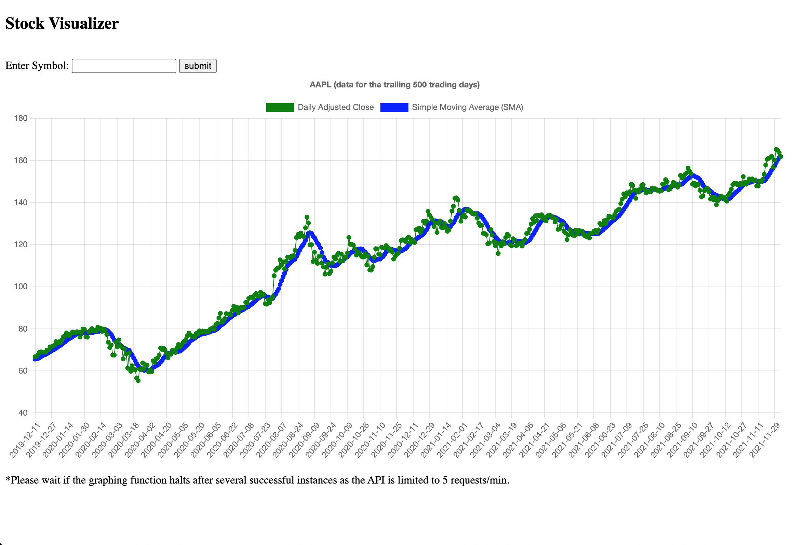

# Stock Visualization Website with Python/Django and Alpha Vantage APIs



## Clone repo and install dependencies

`git clone https://github.com/jun-sung/stock-visualizer.git`

Recommended: **Python 3.6 or higher**. If Python is not installed, follow the download instructions on the [python.org](https://www.python.org/downloads/) website.

## Running the website locally

```shell
(root) $ python3 manage.py runserver
```

See the website in action @ <http://localhost:8000>
